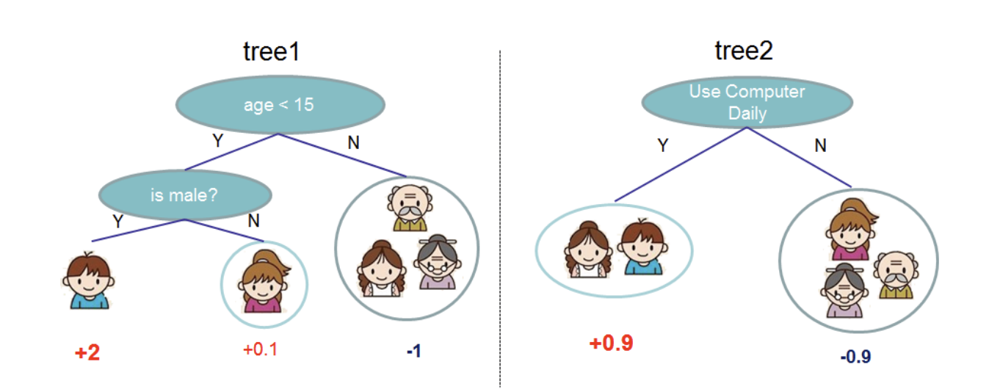

# XGBoost


This is my personal implementation of [XGBoost](https://www.kdd.org/kdd2016/papers/files/rfp0697-chenAemb.pdf)


### **Setup**
To set up the environment, follow these steps:<br>
1) ```conda create --name env pip```<br>
2) ```conda activate env```<br>
3) ```pip install -r requirements.txt```<br>

### **Usage**
In order to the models, open the notebooks ```run_xgboost.ipynb```